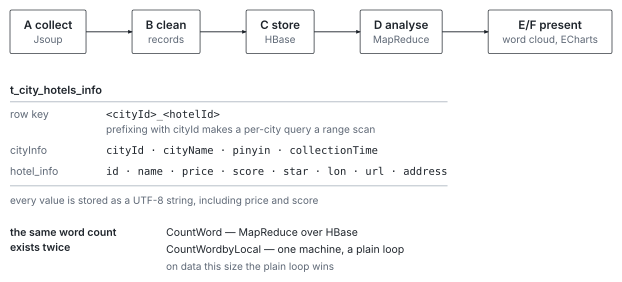

# Tourism Data Analysis

A Java batch pipeline over hotel listings and reviews: scrape with Jsoup, clean
into structured records, persist to HBase, aggregate with Hadoop MapReduce, and
prepare the results for ECharts and a word cloud. A completed data-engineering
study.

[](LICENSE)
[](#project-status)
[](#requirements)
[](#requirements)

## Overview



*The pipeline and its storage schema. The composite row key is what turns a per-city query into a range scan.*

The pipeline has five stages, each in its own top-level package, named `A_` to
`F_` so the order is visible in the directory listing:

```text
A_DataCapture  →  B_DataClean  →  C_DataToHbase  →  D_DataProcess  →  E/F_Visualization
   Jsoup            parse to        HBase            MapReduce         word cloud +
   scrape           records         tables           jobs              ECharts data
```

Two analyses are computed: **average hotel price per city**, and **word
frequency over review text**. The word-frequency job exists in two forms — a
distributed MapReduce version and a local single-machine version — which makes
the repository a reasonable side-by-side of the two.

## Repository layout

```text
src/main/java/
├── A_DataCapture/    # Jsoup collection and HTML parsing
├── B_DataClean/      # hotel and review record extraction
├── C_DataToHbase/    # HBase persistence + internal POJOs
├── D_DataProcess/    # AveragePrice, CountWord, CountWordbyLocal
├── E_DataVisualization/  # word cloud generation
├── F_ChartsData/     # chart data preparation
├── Util/             # HBase, HDFS, HTTP, Jsoup and string helpers
└── pojo/             # Hotel, HotelCity, HotelComment, HotelInfo
src/main/resources/
├── hadoop.properties # cluster hostnames and ZooKeeper port
├── SourceImgs/       # word-cloud mask image
└── TargetImgs/       # word-cloud output, written by the visualization stage
```

## Requirements

- JDK 8
- Maven
- Hadoop 2.7.2 and HBase 1.3.1, with a reachable ZooKeeper quorum

`src/main/resources/hadoop.properties` names the cluster hosts
(`hadoop1`, `hadoop2`, `hadoop3`) and expects HDFS at `hdfs://hadoop1:9000`.
Change them for your own cluster.

`pom.xml` resolves `tools.jar` through `${java.home}`, so the build does not
depend on a specific install path.

## Data and third-party content

The collection stage targets a commercial travel platform. Website content,
trademarks, listings and review text belong to that platform and its users, and
are not covered by this repository's license. Anyone running the collection stage
is responsible for the site's terms of service, applicable data-protection law,
and rate limiting.

No scraped data is committed to this repository.

## Project Status

Archived. A finished study of a Hadoop batch pipeline, kept as a record.

## License

Copyright 2025 Yixuan Huang

The original code in this repository is distributed under the
[Apache License 2.0](LICENSE). Hadoop, HBase, Jsoup and all other dependencies remain
under their own licenses; scraped content remains under the rights of its
source.

## Contact

- Website: [yixuanhuang.com](https://yixuanhuang.com)
- Email: [yixnhuang@gmail.com](mailto:yixnhuang@gmail.com)
